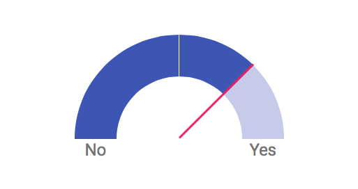

A simple [Material Design](https://www.google.com/design/spec/material-design/introduction.html) gauge control implemented in pure CSS/HTML. Includes a JavaScript implementation to change the gauge value dynamically.



Check out the [live example](http://sathomas.me/material-gauge/).

The basic markup for the gauge is as follows:

```
<div class="gauge" id="myGauge">
	<div class="gauge__container">
		<div class="gauge__marker"></div>
		<div class="gauge__background"></div>
		<div class="gauge__center"></div>
		<div class="gauge__data"></div>
		<div class="gauge__needle"></div>
	</div>
	<div class="gauge__labels mdl-typography__headline">
    	<span class="gauge__label--low">No</span>
    	<span class="gauge__label--spacer"></span>
    	<span class="gauge__label--high">Yes</span>
	</div>
</div>
```

The gauge value is specified by `transform:` property on both the `.gauge__data` and `.gauge__needle` elements. The value for the rotation is
`0.5 × X - 0.5` turns, where `X` ranges from 0 (left-most position) to 1 (right-most position). For example, to set the gauge at "3/4 full", you can specify the `transform` as

```
.gauge__data {
    -webkit-transform: rotate(-0.125turn);
       -moz-transform: rotate(-0.125turn);
        -ms-transform: rotate(-0.125turn);
         -o-transform: rotate(-0.125turn);
            transform: rotate(-0.125turn);
}
.gauge__needle {
    -webkit-transform: rotate(-0.125turn);
       -moz-transform: rotate(-0.125turn);
        -ms-transform: rotate(-0.125turn);
         -o-transform: rotate(-0.125turn);
            transform: rotate(-0.125turn);
}
```

As the example indicates, you probably want to use vendor prefixes for maximum compatibility.

If you wish, you can use the included JavaScript component to set and update the gauge value. The component API is quite simple. First, create a new object:

    var gauge = new Gauge();
	
You can optionally pass a DOM element (constructed as above) to the constructor:

	var gauge = new Gauge(document.getElementById("myGauge"));

If you don't pass the DOM element as a constructor parameter, you can initialize it later using the `element()` method:

	gauge.element(document.getElementById("myGauge"));

> Note that the component will not construct the DOM element itself. You must supply a pre-constructed element with the sub-elements indicated above.

Once you have an initialized constructor, set the value (between 0 and 1) using the `value()` method:

    gauge.value(0.75);

As a final enhancement, if you're going to update the gauge live on the page, you can add the `gauge--liveupdate` class to the parent element. This will enable a nice CSS-based animation for value updates.

